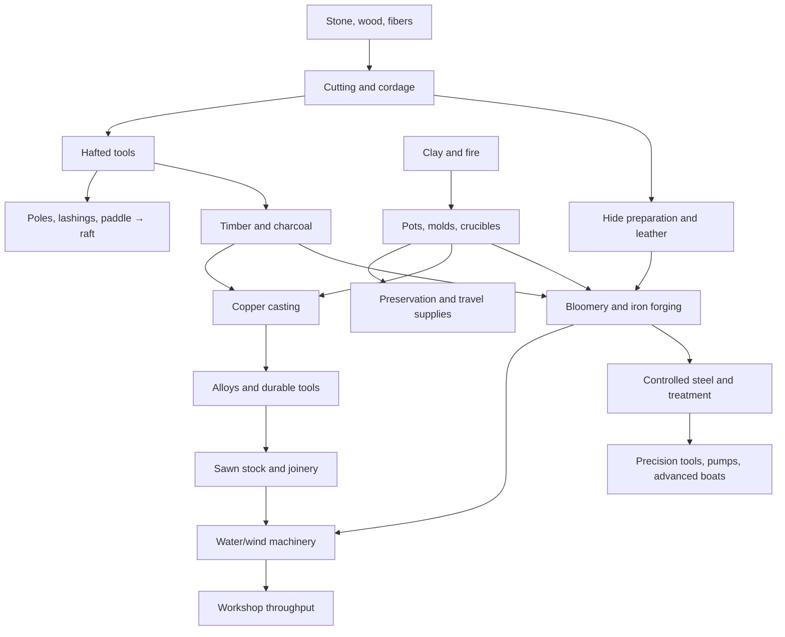

# Crafting system design guide

Design proposal v1 · 6 September 2026 · endpoint approved by Matt: steel, water/wind power, and advanced workshops.

This is a proposed game system and modeling plan, not an implemented recipe engine. The approved bamboo raft is an existing 25 mm voxel asset. The knife, cordage, axe and their components have draft models, now rebuilt at 12.5 mm for readability at Matt's request. Other items remain a production backlog. Base terrain cells are 100 mm; entity asset pitch is independent of terrain pitch.

## Design direction

Make progress mean **being able to do something new**. A knife prepares fibers; cordage fastens an axe head; the axe supplies timber; timber supports charcoal production; pottery supplies crucibles; casting supplies metal tools; joinery and iron fittings make machines. Each achievement makes earlier work easier while opening another activity.

Keep several branches alive at once. A player can become an excellent boatbuilder, farmer, potter, hunter, or textile maker without completing every metallurgy milestone. A new metal should not invalidate baskets, stone mortars, bone awls, or wooden paddles. The raft belongs in early survival, before copper.

Use milestone names to explain the world, not a global age lock. An acquired iron axe works immediately. Reproducing it requires the appropriate materials, workshop, and processes. Recipes show missing prerequisites before the player owns them.

## Research and what to borrow

| Evidence | Design implication |
|---|---|
| Minecraft makes progression legible through familiar tool families and harvest gates. Its September 2025 Copper Age release added copper tools with greater speed and durability than stone; copper belongs in a current comparison. [Official release](https://www.minecraft.net/en-us/article/minecraft-java-edition-1-21-9) | Borrow clear silhouettes, understandable prerequisites, and satisfying upgrades. Add capabilities beyond harvest speed. |
| Vintage Story separates stone working, pottery, casting, and smithing. Its tool reference distinguishes material tiers and which tools can be cast. [Tools](https://wiki.vintagestory.at/Tools/en), [knapping](https://wiki.vintagestory.at/Knapping), [clay forming](https://wiki.vintagestory.at/Clay_forming) | Make a tool head a workpiece with visible manufacturing stages. Do not reduce every tool to an inventory-grid recipe. |
| Vintage Story's bloomery and iron working introduce a different production route from copper casting. Steelmaking joins several workshop dependencies; mechanical power connects machines. [Bloomery](https://wiki.vintagestory.at/Bloomery/en), [iron](https://wiki.vintagestory.at/index.php?title=Iron), [steelmaking](https://wiki.vintagestory.at/Steel_making), [mechanical power](https://wiki.vintagestory.at/Mechanical_power) | Borrow interdependent workshops and automation of established manual jobs. Avoid unnecessary recipe repetition and a single rare-mineral bottleneck. |
| Archaeological stone tools supported both cutting and pounding; tool development involved food processing as well as extraction. [Smithsonian Human Origins](https://humanorigins.si.edu/human-characteristics/tools-food) | Start with functional distinctions: sharp flake, hammerstone, scraper, digging stick, and containers. Stone is a material family, not one universal capability. |
| Archaeometallurgy distinguishes melting from ore smelting, casting from forging, and copper alloys from iron. Bloomery iron is a solid, slag-bearing product that needs working. Copper is soft and ductile; alloy and treatment affect performance. [Historic England, Archaeometallurgy](https://historicengland.org.uk/images-books/publications/archaeometallurgy-guidelines-best-practice/heag003-archaeometallurgy-guidelines/) | Copper casting and iron bloom refining need different processes. Ore does not become a finished iron tool through a generic melt button. |
| Bloomery processes can produce steel with suitable control. A tidy universal copper → bronze → iron → steel chronology would be misleading. [Historical Metallurgy Society: bloomery](https://old.historicalmetallurgy.org/glossary/bloomery/) | Our late steel milestone means reliable, repeatable steel production and treatment. It is a gameplay progression, not a claim that earlier people could never produce steel. |

Historical practice varied by region and available resources. Bronze is useful without being a mandatory prerequisite for every iron source. Wood, fiber, bone, clay, hides, abrasives, fuel, and refractory materials deserve as much design attention as ores. These sources inform the proposal; the unlocks and balance rules below are original game design choices.

## Taxonomy: classify tools by their job

Every definition has a stable item ID, a functional family, a role, and capabilities. Roles are `tool`, `component`, `consumable`, `container`, `station`, `machine`, and `vehicle`. Material and manufacturing method are separate fields. An axe is one family with compatible heads, hafts, and bindings; it is not a wholly unrelated item for each ore.

| Family | Early examples | Later examples | New functionality |
|---|---|---|---|
| Cutting and scraping | Flake knife, scraper | Metal knife, shears | Fibers, hide preparation, food preparation, cloth cutting |
| Chopping and splitting | Stone axe, wedge, maul | Metal axe, splitting tools | Timber harvesting, split boards, fuel processing |
| Woodworking and joinery | Stone adze, bow drill | Saw, chisel, auger, plane | Fitted planks, mortises, barrels, wheels, hulls |
| Digging and extraction | Digging stick, antler pick | Shovel, pickaxe, prospecting hammer | Soil work, soft deposits, hard-rock mining, sampling |
| Striking and forming | Hammerstone, wooden mallet | Smithing hammer, stakes, anvil | Knapping, assembly, hot forging, sheet and rivet work |
| Piercing and sewing | Bone awl, needle bundle | Metal awl, needle, punch | Leather containers, clothing, sails, bellows |
| Farming and harvesting | Digging stick, stone hoe, sickle | Metal hoe, scythe, plow | Cultivation, faster harvest, larger fields |
| Hunting and fishing | Spear, hook, trap | Bow, fishing net, metal spear | Different prey and food strategies; no mandatory combat gate for metallurgy |
| Fire and heat | Friction fire kit, hearth | Kiln, forge, bloomery, refining furnace | Cooking, ceramics, charcoal, casting, iron, controlled steel |
| Grinding and mixing | Mortar, hand quern | Millstones, powered crusher | Flour, pigments, ore preparation, bulk processing |
| Binding and textiles | Cordage, rope, spindle | Loom, leather straps, sailcloth | Hafting, shelter, transport, lifting, wind capture |
| Storage and preservation | Basket, skin bag | Crock, barrel, drying rack, smokehouse | Carry capacity, liquids, food life, reliable travel |
| Transport and rigging | Sled, pole, paddle, lashed raft | Cart, tackle, sail raft, plank boat | Cargo, river travel, hauling, more demanding waterways |
| Measurement and power | Straightedge, plumb line, hand crank | Dividers, waterwheel, windmill, shafts, gears | Alignment, controlled motion, automation, pumping |

Distinct action profiles matter. An axe chops across grain; an adze shapes a surface; a wedge splits along grain; a saw produces regular stock with different waste and time. A knife can improvise some jobs slowly, but should not replace every specialist.

## Material roles and meaningful sidegrades

| Material | Appropriate roles | Tradeoff and identity |
|---|---|---|
| Flint/chert | Flaked cutting heads, scrapers, small points | Renewable local maintenance; limited impact tolerance; suitable stone required |
| Obsidian | Fine cutting edges and points | Very sharp but brittle; poor choice for striking or prying |
| Tough ground stone | Axe/adze heads, hammers, grinding surfaces | Slow shaping; long useful life in appropriate jobs |
| Wood/bamboo | Hafts, handles, shafts, wedges, vessels, structural members | Species, grain, moisture, and section affect the job; bamboo is not a metal substitute |
| Bone/antler | Awls, needles, hooks, soft-ground tools | Lightweight, specialized, stays useful after metal |
| Plant fiber/rawhide/leather | Lashings, ropes, straps, bellows, soft containers | Wet strength, flexibility, abrasion resistance, and preparation differ |
| Fired clay/refractory ceramic | Pots, molds, crucibles, furnace linings | Container and thermal functions; ordinary cooking clay is not universally refractory |
| Copper | Cast heads, fittings, sheet containers | Reworkable and recoverable; softer edges need maintenance; valuable access to casting |
| Tin bronze | Cast durable heads, fittings, bearings | Better edge and casting options; tin availability creates trade demand |
| Wrought/bloom iron | Fasteners, chain, tools, structural fittings | Local ore and workshop labor can favor scale; not automatically superior to every bronze tool |
| Controlled steel | Treated cutting edges, files, drills, selected working faces | Edge retention and demanding work; heat treatment and repair require care |

Do not generate a full cartesian product of tool × material. No obsidian hammer, clay pickaxe, or automatic gold tool tier. Tin is primarily an alloy input. Charcoal is an early industrial fuel; coal is an optional regional resource, not a required universal gate. Steel is a manufactured iron-carbon material, not an ore. Visually colored voxels are appearance data, not a chemical composition ledger.

## Compounding milestones

These are overlapping workshop capabilities. Approximate ordering guides onboarding; geography and trade permit alternate routes.

| Milestone | Required achievements | Representative craftables | Newly available play |
|---|---|---|---|
| 1. Gather and shape | Gather appropriate stone, wood, fibers; knap and twist | Hammerstone, flake knife, cordage, digging stick | Processing plants and food, light excavation, basic attachment |
| 2. Bind and build | Haft heads; establish fire; process poles and hides | Axe, adze, spear, awl, basket, paddle, bushcraft raft | Shelter construction, cargo carrying, river crossings, trapping |
| 3. Control heat and storage | Form and fire clay; make charcoal; prepare leather | Cooking pot, crock, crucible, molds, kiln, bellows | Food surplus, liquids, travel provisions, metalworking prerequisites |
| 4. Cast copper | Gather accessible copper; prepare fuel and ceramic casting equipment | Copper axe/pick/hammer, fittings | Productive mineral extraction, replaceable metal heads, recycling |
| 5. Alloy and join | Obtain tin or traded alloy; develop saw/chisel work | Bronze tools, workbench, barrel, cart, loom | Precise assemblies, expanded storage, textile production, better hauling |
| 6. Refine iron | Prepare ore; supply draft and fuel; consolidate bloom on a workable anvil | Bloomery, forge, iron tools, nails, chain, hardware | Workshop scale, stronger fastenings, more repairable vehicles and machines |
| 7. Harness motion | Joinery, shafts, bearings, power site and a useful load | Waterwheel/windmill, gearing, powered quern, helve hammer | Bulk food and material processing; reduced repetitive labor |
| 8. Control steel and precision | Reliable iron supply, refractory heat control, treatment and abrasives | Steel edges, files, augers, precision bench, pump | Advanced joinery, deep-worksite drainage, demanding tools and complex boats |

Milestone 7 is a parallel branch: a wooden waterwheel and simple mill may precede steel, and bronze fittings may substitute for iron where appropriate. Steel remains manually producible so a powered hammer cannot be its own prerequisite. Stronger machines improve throughput and labor demand, not the player's right to begin.

The diagram shows major relationships, not the complete recipe grammar. In particular, iron has an accessible surface-ore bootstrap route without tin, and hand processes remain available alongside machines.

## Crafting rules

**A recipe requires materials AND usable tool capabilities AND a station/process environment.** A requirement can explicitly offer alternatives: plant rope OR suitable hide lashing. A missing saw does not prohibit all board production: splitting and adzing produces rough stock at a different cost and quality; a saw unlocks regular stock and finer joinery.

Separate reusable tools from consumed ingredients. Record tool wear, fuel use, output quantity, waste, recoverable scrap, and unfinished work. A worn axe head can be resharpened; a broken handle can be replaced without destroying a sound head. Sharpening gradually consumes edge stock. Remelting tracks actual material recovery and cannot duplicate metal.

Workpiece states are explicit: raw clay → formed → dried → fired; ore → prepared charge → bloom → consolidated billet → shaped head → treated/finished head → hafted tool. Heat and moisture bands should be readable game parameters. Exact thresholds and yields need balance and materials work; this proposal intentionally does not claim universal physical values.

Use short tactile interactions to teach a process, then allow repeat batches, saved patterns, assistants, and powered production. Avoid forcing players to repeat the same voxel minigame hundreds of times. Skill improves speed, waste, consistency, and handling. It should not block ordinary survival recipes behind grind-only XP requirements.

Distinguish discovery from availability. The journal remembers an unlocked recipe, but crafting still checks current tools, fuel, station condition, space, and inputs. A shared workshop can provide capabilities within reach. Multiplayer station queues reserve inputs and outputs; a second player cannot consume the same ingredients.

## Three example production chains

### Early raft: no metal required

Flake knife → prepared fiber → cordage; stone axe/adze → cut poles and shaped paddle; poles + transverse bearers + lashings → raft frame → completed raft. Use several tied bundles/attachment stations as visible build steps. A bamboo region supplies culms; a forest supplies suitable logs. Those are different vehicle recipes with different cargo and handling parameters, not identical mass inferred from voxel count.

Later upgrades add cargo lash points, a storage platform, replaceable bindings, steering fittings, or a sail rig. Each upgrade must have plausible attachment geometry. Buoyancy, collision, stability, and safe payload need gameplay validation independently of the approved mesh. Two vertical posts alone do not establish a working sail system.

### Food surplus to metalworking

Knife/scraper + hide processing → leather → bellows. Digging stick + suitable clay → pots and crucibles → stored food and casting equipment. Axe → wood → charcoal. These branches converge at a workshop. Food preservation supports longer prospecting expeditions, but a specific food item is not a mandatory recipe ingredient for a metal tool.

### Iron to an advanced workshop

Accessible iron-bearing material + prepared fuel + furnace draft → bloom; hammer + stone/bronze working surface + forge → consolidated iron. Iron fittings + wooden joinery → stronger shafts and machinery. Repeatable steel treatment → files and augers → precision joinery and a piston pump. The first pump is hand operated; adding a power connection improves its use. A powered hammer accelerates iron/steel work without making manual production impossible.

## Geography, recovery, and balance

- Provide an early survival path using common local resources. A missing bamboo biome must not remove water travel; use the log raft route.
- Make accessible surface copper distinct from deep ore. Copper cannot require a copper pick to obtain its first usable supply.
- Tin bronze is one valuable route. An accessible iron route or trade avoids a tin-only world-generation deadlock. Hard deposits still reward better extraction tools.
- If the player loses advanced tools, known recipes remain visible and the stone/ceramic bootstrap remains possible. Existing stations, traded heads, and recovered scrap shorten recovery.
- Workshop placement should reward fuel, water, food, and transport access. Avoid making every resource globally abundant, but expose alternatives before players waste hours searching.
- Tune action time, edge life, repair burden, output quality, carry weight, and process batch size separately. Do not apply one metal-tier multiplier to every statistic.
- Start balance with measured player tasks: build a shelter, feed two people, cross a river with cargo, replace a lost tool, run one metal batch. Numeric recipe amounts and times remain provisional until these loops are playable.

## Implementation fit with this repository

Matt selected binary subdivision: 100 → 50 → 25 → 12.5 mm. Craftables and creatures may use 12.5 mm; environment detail stops at 25 mm, and terrain-stamped assets retain 100 mm. See the [implementation and migration notes](binary-voxel-pitches.md) for completed core work and remaining game integration. The earlier [10 mm review](craft-lattice-10mm-architecture-review.md) is historical analysis.

The inspected item registry uses `FName ItemId` separately from terrain/material IDs. It reserves a `Tool` category but currently defines no tool rows in `VoxelItem.cpp`. Inventory stacks hold item IDs and counts; tool condition and component state need a deliberate per-instance extension. The craft lattice is fine-resolution terrain editing, not this recipe progression engine.

Implement in this order:

1. **Definitions and use actions:** gameplay material registry, capability registry, tool families, item instances, equipped action dispatch. Prove knife, hammerstone, axe, cordage, and paddle behavior.
2. **Transactional recipes:** atomic multi-stack input consumption, retained-tool validation/wear, output capacity handling, and authoritative multiplayer execution. Prove cancellation and full-inventory behavior.
3. **Workpieces and stations:** staged pottery/casting/forging, station state, queues, heat/fuel abstractions, save/load. Persist partial jobs and material accounting.
4. **Vehicles and storage:** raft assembly and upgrades, inventories, repair attachments, collision and payload verification.
5. **Power and automation:** connected shaft network, available torque/speed, loads, jams/disconnects, hand-powered equivalents, then water/wind generators.

Asset Forge's `craftable` category already separates entity assets from terrain scattering. Keep that boundary. Add gameplay bindings in a separate manifest mapping item IDs to approved library assets, sockets, colliders, and view offsets. Do not overload color palette IDs with ore identity or add taxonomy fields to generator parameters that reseed unrelated assets.

The companion [capability graph](design/crafting-capabilities-v1.json) is a **logical design graph** with AND prerequisites and OR alternatives. It is not a balanced recipe database: quantities, durability, power, and process timings are intentionally outside it. Its validator checks all defined capabilities are reachable and exercises no-metal/no-tin/no-power recovery scenarios. Reachability assumes sufficient quantities of the declared accessible resources; it does not prove world generation, economy, station geometry, or runtime correctness.

See the [modeling roadmap](../asset-forge/docs/craftable-modeling-roadmap.md) for the first production batches and 25 mm art rules. The first [knife, cordage and stone axe modeling set](../asset-forge/docs/survival-starter-assets.md) now has eight draft models and exports; these are awaiting visual review and are not implemented gameplay recipes.

## Initial playable slice and acceptance criteria

Build one complete loop before broadening the catalog: gather → knife → cordage → axe/adze → paddle and raft → carry clay/ore by water → pottery and charcoal → first copper tool. This exercises gathering, manufacturing, transport, storage, and repair with a small coherent asset set.

The slice succeeds when a new player can see why the next tool matters; assemble and repair a raft without metal; obtain their first copper without a metal tool; recover after losing a tool; and save/reload every unfinished process without loss or duplication. Later slices add bronze/iron alternatives, then useful machinery, then controlled steel. No electrical or steam tier is included in v1.
